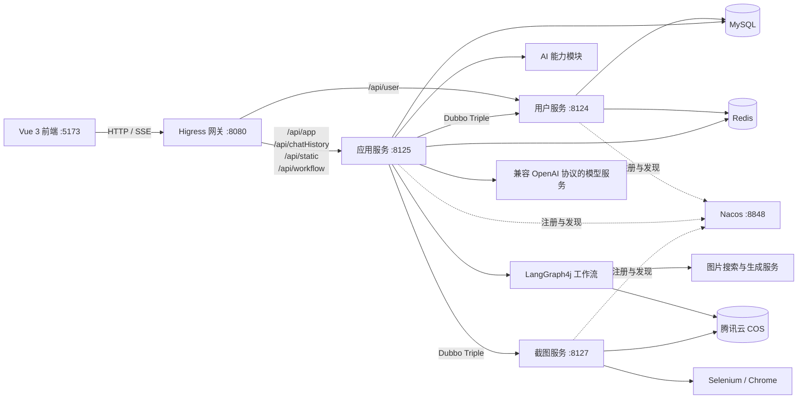
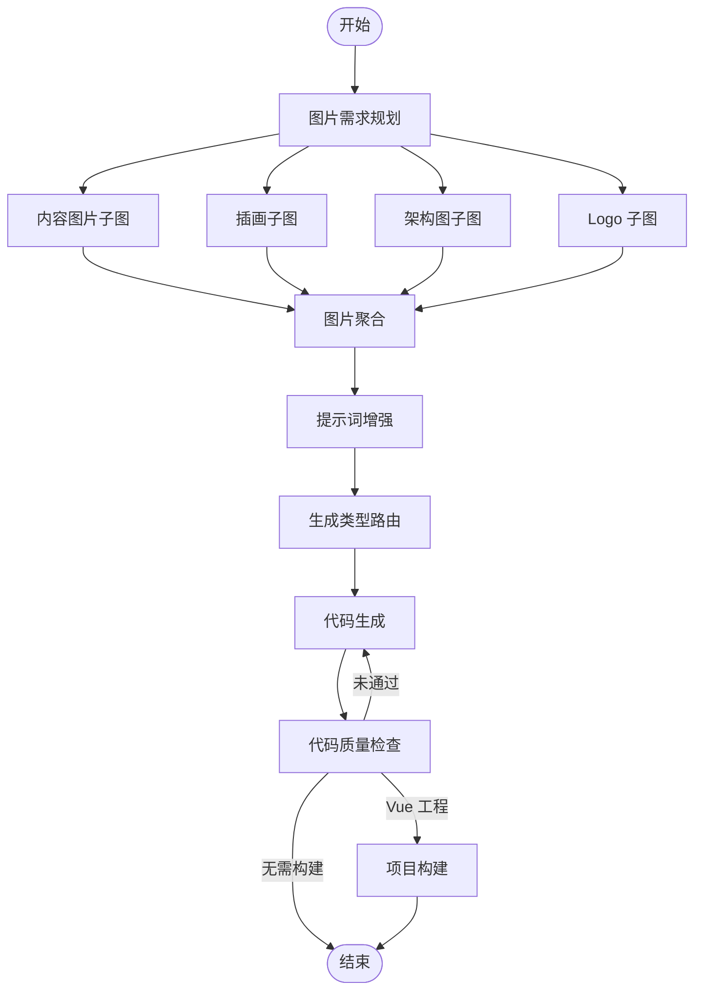
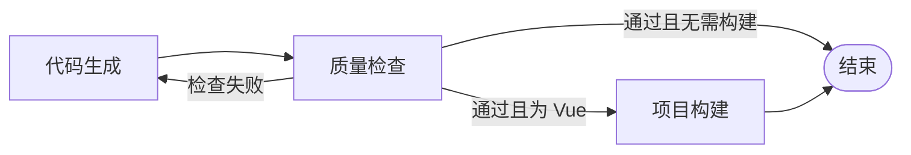
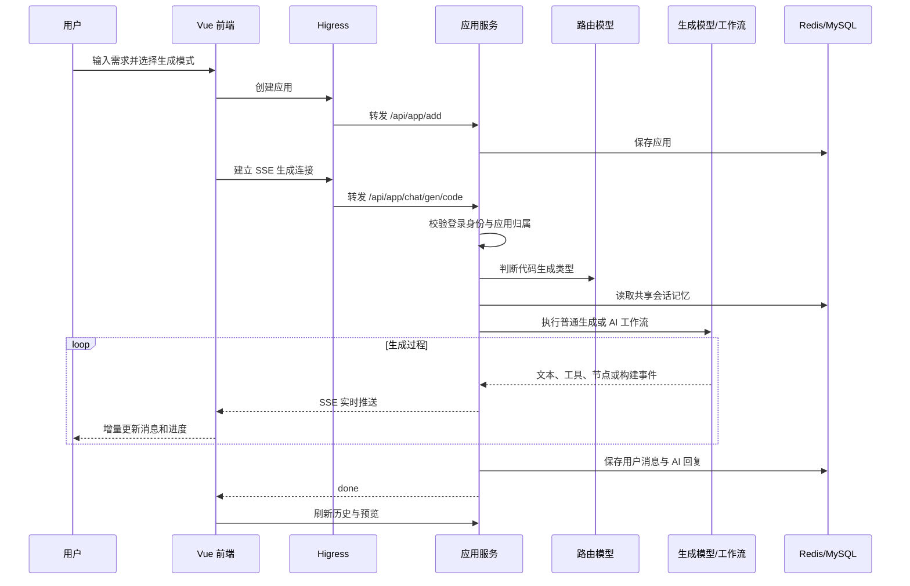

# 灵构 AI 应用生成平台

灵构是一个面向网站与前端工程开发场景的 AI 应用生成平台。用户通过自然语言描述需求，系统能够自动选择代码生成类型，并完成素材收集、代码生成、增量修改、质量检查、工程构建、预览和部署。

项目采用 **Vue 3 + Spring Boot 微服务架构**，结合 **LangChain4j 工具调用**与 **LangGraph4j 状态图编排**实现普通生成和 AI 工作流两种模式。两种模式共享同一应用的工程文件和会话记忆，可以在不丢失上下文的情况下切换并继续修改。

## 1. 项目定位与核心功能

项目不是一次性返回代码片段的聊天工具，而是以 `appId` 为业务主线，将用户权限、对话历史、AI 记忆、工程文件、实时预览和部署结果关联起来，形成可持续修改的应用生成流程。

| 核心能力 | 实现方式 |
| --- | --- |
| 自然语言生成应用 | LangChain4j 封装模型调用，路由模型在 HTML、多文件网站和 Vue 工程之间选择生成策略 |
| 普通生成与工作流生成 | 普通模式缩短生成链路，工作流模式增加素材、增强和质量检查节点 |
| 多轮增量修改 | Redis 保存消息窗口，MySQL 持久化完整对话历史，应用目录保留已生成工程 |
| Vue 工程修改 | AI 通过文件工具读取、创建、修改和删除工程文件，不重复输出完整项目 |
| 实时生成反馈 | Reactor Flux 与 SSE 推送文本、工具调用、工作流状态和构建进度 |
| 可视化元素修改 | iframe 选中元素后传递选择器、DOM 路径和文本，形成精确修改指令 |
| 图片素材处理 | 并行处理内容图片、插画、Logo 和架构图，并将生成资源上传 COS |
| 质量检查 | 质量节点检查生成结果，不通过时循环回代码生成节点 |
| 预览、下载与部署 | 工作目录支持即时预览，源码可打包下载，稳定版本复制到独立部署目录 |
| 用户与后台管理 | 用户只能管理自己的应用，管理员可维护用户、应用和对话记录 |

系统支持三种代码生成类型：

| 类型 | 生成结果 | 处理方式 |
| --- | --- | --- |
| `HTML` | `index.html` | 解析模型结构化结果并保存为单文件页面 |
| `MULTI_FILE` | `index.html`、`style.css`、`script.js` | 分别解析并保存结构、样式和脚本 |
| `VUE_PROJECT` | 完整 Vue 工程 | 通过 Tool Calling 操作项目文件，再执行生产构建 |

## 2. 微服务架构图和技术栈



Higress 负责统一入口和路由转发，Nacos 负责服务注册与发现，Dubbo Triple 负责内部 RPC 调用。Redis 同时承担共享登录会话、AI 对话记忆、业务缓存和限流状态存储。

### 技术栈

| 层级 | 技术 | 用途 |
| --- | --- | --- |
| 前端 | Vue 3、TypeScript、Vite | 页面开发、类型约束和工程构建 |
| UI 与状态 | Ant Design Vue、Pinia、Vue Router | 组件、登录状态和路由权限 |
| 请求与渲染 | Axios、EventSource、Markdown-It、Highlight.js | REST 请求、SSE、消息渲染和代码高亮 |
| 后端 | Java 21、Spring Boot 3.5.3 | 微服务运行基础 |
| 微服务 | Spring Cloud 2023.0.1、Spring Cloud Alibaba 2023.0.1.0 | 服务治理体系 |
| RPC 与注册中心 | Dubbo 3.3.0、Nacos | 内部调用、注册与发现 |
| AI | LangChain4j、LangGraph4j 1.6.0-rc2 | 模型调用、工具调用、记忆和状态图编排 |
| 响应式流 | Reactor、SSE | 长耗时生成任务的实时输出 |
| 数据访问 | MySQL、MyBatis-Flex | 用户、应用和对话历史持久化 |
| 缓存与会话 | Redis、Spring Session、Redisson、Caffeine | 会话、记忆、缓存、限流和实例复用 |
| 网关与部署 | Higress、Nginx、Docker | 路由转发、静态资源访问和容器运行 |
| 图片与文件 | Pexels、UnDraw、DashScope、Mermaid CLI、腾讯云 COS | 图片搜索、生成、渲染和存储 |
| 网页截图 | Selenium、WebDriverManager | 部署网站截图与封面生成 |

### 微服务模块

```text
ai-code-microservice/
├─ ai-code-common/       # 统一响应、异常、常量、COS 和公共配置
├─ ai-code-model/        # Entity、DTO、VO、枚举和事件模型
├─ ai-code-client/       # Dubbo 内部服务契约
├─ ai-code-ai/           # AI 接口、模型配置、提示词、护轨和文件工具
├─ ai-code-user/         # 用户、登录会话和用户权限
├─ ai-code-app/          # 应用、生成、工作流、对话、构建和部署
└─ ai-code-screenshot/   # 网页截图、图片压缩和 COS 上传
```

## 3. 普通模式与 AI 工作流模式

### 普通模式

```text
用户需求 → 生成类型路由 → 代码生成或工具调用 → Vue 构建 → 完成
```

普通模式直接进入路由与生成流程，适合快速创建、样式调整和日常增量修改。

### AI 工作流模式



工作流模式在生成前完成素材规划和提示词增强，在生成后执行质量检查与工程构建，适合首次创建或对完整度要求较高的场景。

## 4. 共享会话记忆机制

AI Service 使用 `appId + 代码生成类型` 作为 Caffeine 缓存键，以复用动态创建的服务代理；实际消息记忆使用 `appId` 作为 `MessageWindowChatMemory` 的 ID，并通过 `RedisChatMemoryStore` 持久化。

```text
普通模式 ─┐
          ├─ appId → MessageWindowChatMemory → RedisChatMemoryStore
工作流模式 ┘                         ↓
                              MySQL 对话历史
```

具体流程如下：

1. 首次获取 AI Service 时，根据应用 ID 和代码类型创建代理。
2. 从 MySQL 恢复该应用已有的用户消息和 AI 回复。
3. 当前消息窗口写入 Redis，供普通模式和工作流模式共同读取。
4. 后续请求命中 Caffeine 缓存，避免重复创建代理和重复恢复历史。
5. Vue 工程使用更大的消息窗口，以容纳文件工具调用和工程上下文。

生成模式只是本次请求的执行策略，不会创建第二套应用数据，因此切换模式后仍可以在原有工程上继续修改。

## 5. SSE 流式输出流程

```text
模型 TokenStream / 文件工具 / 工作流节点 / Vue 构建器
                         ↓
              GenerationStreamEvent
                         ↓
             Flux<ServerSentEvent<String>>
                         ↓
                Higress / Nginx
                         ↓
             EventSource + Vue 增量渲染
```

| 事件 | 作用 |
| --- | --- |
| 普通消息 | 传输文本片段、修改摘要和工具结果 |
| `build_start` | 通知前端开始构建 Vue 工程 |
| `build_progress` | 传输项目检查、安装依赖和编译进度 |
| `build_complete` | 通知前端构建完成并刷新预览 |
| `generation_error` | 在流已经建立后传输结构化异常信息 |
| `done` | 标记本轮生成正常结束 |
| SSE 注释心跳 | 每 15 秒保持连接，不写入聊天消息 |

响应设置 `Cache-Control: no-cache, no-transform` 和 `X-Accel-Buffering: no`，防止代理层聚合流式数据。前端将短时间内收到的字符分片合并后统一渲染，减少频繁页面更新。

## 6. Vue 工程工具调用

Vue 工程不要求模型一次返回所有文件，而是向模型提供受控的工程工具：

| 工具 | 作用 |
| --- | --- |
| `FileDirReadTool` | 查看工程目录结构 |
| `FileReadTool` | 读取现有文件并获取修改上下文 |
| `FileWriteTool` | 创建或覆盖文件 |
| `FileModifyTool` | 修改指定文件内容 |
| `FileDeleteTool` | 删除不再需要的文件 |
| `ExitTool` | 明确结束本轮工具调用 |

`ProjectFileToolSupport` 统一解析和规范化目标路径，确保工具只能访问当前应用目录。`ToolManager` 负责工具注册、调用执行和结果展示。前端仅展示本轮修改内容及执行摘要，不重复输出完整工程源码。

## 7. 可视化元素修改

预览区域通过 iframe 加载生成页面。用户进入选择模式并点击元素后，子页面使用 `postMessage` 向编辑页面传递：

- 元素标签和可见文本；
- 可复现的 CSS 选择器；
- 选择器命中数量；
- 元素 DOM 层级路径；
- 必要的 HTML 摘要。

前端将结构化元素信息与用户修改要求组合后发送给 AI，使模型能够定位到具体组件或节点。退出选择模式后，预览页面恢复正常交互。

## 8. 图片素材并发子图

图片规划节点首先判断页面需要的素材类型，再将任务拆分为四个独立子图：

| 子图 | 实现方式 |
| --- | --- |
| 内容图片 | 根据页面主题调用 Pexels API 搜索真实图片 |
| 插画 | 从 UnDraw 获取符合语义的 SVG 插画 |
| 架构图 | 生成 Mermaid 描述，调用 Mermaid CLI 渲染并上传 COS |
| Logo | 调用 DashScope 图片生成接口，下载结果并上传 COS |

四个子图使用专用线程池并发执行，完成后进入图片聚合节点。聚合结果被写入 `WorkflowContext`，再由提示词增强节点添加到最终生成需求中。每个子图只负责自己的素材类型，避免 AI 在图片收集阶段执行无关任务。

## 9. 代码质量检查与循环边

代码生成结束后进入质量检查节点，检查页面结构、代码完整性、工程可构建性及是否满足用户需求。质量结果写入 `WorkflowContext`，条件边根据检查结论决定后续路径：



- 检查失败：返回代码生成节点，并携带质量反馈重新生成。
- Vue 工程检查通过：进入项目构建节点。
- HTML 或多文件项目检查通过：跳过构建并结束工作流。

循环由状态图条件边控制，不需要在节点内部手动递归调用生成服务。

## 10. 构建、预览、下载、部署和截图

1. 生成文件写入 `tmp/code_output`，作为继续修改和在线预览的工作目录。
2. VueProjectBuilder 检查 `package.json`，安装依赖并执行生产构建，同时通过 SSE 返回构建进度。
3. 静态资源接口从规范化后的工作目录读取文件，提供即时预览。
4. 下载服务将源码压缩为 ZIP，Vue 工程会排除 `node_modules`、`dist` 等可重新生成目录。
5. 部署时将稳定内容复制到 `tmp/code_deploy/{deployKey}`，Vue 工程仅发布 `dist` 内容。
6. 部署成功后，应用服务使用 Java 虚拟线程异步调用截图服务。
7. 截图服务通过 Selenium 打开部署地址，压缩图片并上传 COS，再更新应用封面。

工作目录和部署目录相互隔离，正在进行的修改不会直接覆盖线上稳定版本。截图属于部署后的附加流程，截图失败不会回滚已经成功的静态网站部署。

## 11. 用户权限、缓存、限流、安全护轨和稳定性设计

### 用户权限

- Spring Session 将登录态保存到 Redis，用户服务和应用服务共享登录会话。
- “我的应用”查询由服务端强制使用当前用户 ID，不接受客户端指定其他用户作为权限依据。
- 查询私有详情、编辑、删除、下载和部署均校验应用 `userId` 与当前用户 ID。
- 管理接口额外校验管理员角色。

### 缓存与并发

- Caffeine 按“应用 ID + 生成类型”缓存 AI Service。
- Redis Cache 默认 TTL 为 30 分钟，精选应用列表单独设置为 5 分钟，并禁止缓存空值。
- 流式模型和推理模型使用原型实例，避免多个用户共享有状态模型对象。
- 图片子图使用专用线程池并发执行，截图任务使用虚拟线程异步执行。

### 限流与安全护轨

- Redisson 分布式令牌桶按用户限制生成请求，当前规则为每 60 秒最多 5 次。
- 输入护轨在模型调用前检查危险、恶意和越权提示词。
- 输出护轨在模型结果不符合约束时执行有限次数重试。
- 模型调用不存在的工具时，将标准化错误反馈给模型进行修正。
- 文件工具、预览和下载统一执行路径规范化，阻止目录穿越。

### 稳定性

- 不同模型可分别配置连接超时、读取超时和最大重试次数。
- SSE 通过心跳维持长连接，流内异常使用 `generation_error` 返回。
- 图片、截图等附加任务与核心生成或部署结果隔离，附加任务失败不破坏主结果。
- 数据库保存完整对话历史，服务重启后可重新恢复 Redis 消息窗口。

## 12. 核心请求时序图



## 13. 主要接口与网关路由

### 主要接口

统一网关前缀为 `/api`。

| 模块 | 方法与路径 | 说明 |
| --- | --- | --- |
| 用户 | `POST /api/user/register` | 用户注册 |
| 用户 | `POST /api/user/login` | 用户登录 |
| 用户 | `GET /api/user/get/login` | 获取当前用户 |
| 用户 | `POST /api/user/logout` | 退出登录 |
| 用户 | `POST /api/user/update/my` | 修改个人资料 |
| 应用 | `POST /api/app/add` | 创建应用 |
| 应用 | `GET /api/app/my/get/vo` | 获取自己的应用详情 |
| 应用 | `POST /api/app/my/list/page/vo` | 分页查询自己的应用 |
| 应用 | `POST /api/app/update` | 修改自己的应用 |
| 应用 | `POST /api/app/delete` | 删除自己的应用 |
| 生成 | `GET /api/app/chat/gen/code` | 建立代码生成 SSE 连接 |
| 对话 | `GET /api/chatHistory/app/{appId}` | 分页读取应用对话历史 |
| 部署 | `POST /api/app/deploy` | 部署应用 |
| 下载 | `GET /api/app/download/{appId}` | 下载应用源码 |
| 预览 | `GET /api/static/{directoryName}/**` | 访问生成中的静态资源 |
| 工作流 | `GET /api/workflow/execute-flux` | 单独执行工作流 SSE 接口 |

### Higress 路由

| 网关路径 | 目标服务 | HTTP 端口 |
| --- | --- | --- |
| `/api/user/**` | `ai-code-user` | 8124 |
| `/api/app/**` | `ai-code-app` | 8125 |
| `/api/chatHistory/**` | `ai-code-app` | 8125 |
| `/api/static/**` | `ai-code-app` | 8125 |
| `/api/workflow/**` | `ai-code-app` | 8125 |

SSE 路由需要关闭响应缓冲，并将读取超时设置为大于一次完整代码生成和 Vue 构建所需的时间。

## 14. 环境变量、本地启动步骤和服务端口

### 环境要求

- JDK 21
- Maven 3.9+
- Node.js 20.19+ 与 npm
- MySQL 8
- Redis 6+
- Nacos 2.x
- Higress
- Chrome 或 Chromium
- Mermaid CLI 与中文字体

### 数据库初始化

```text
src/main/sql/create_table.sql
src/main/sql/upgrade_chat_history_message.sql
```

先执行建表脚本；已有旧表结构时，再根据实际情况执行升级脚本。

### 环境变量

真实密码和密钥应通过操作系统、IDE 私有运行配置或部署平台的密钥管理注入。

```powershell
$env:DB_URL = "jdbc:mysql://127.0.0.1:3306/your_database"
$env:DB_USERNAME = "your_username"
$env:DB_PASSWORD = "your_password"

$env:REDIS_HOST = "127.0.0.1"
$env:REDIS_PORT = "6379"
$env:REDIS_PASSWORD = "your_password"

$env:NACOS_HOST = "127.0.0.1"
$env:NACOS_PORT = "8848"
$env:NACOS_USERNAME = "your_username"
$env:NACOS_PASSWORD = "your_password"

$env:AI_BASE_URL = "https://your-model-endpoint/v1"
$env:AI_API_KEY = "your_key"
$env:AI_MODEL_NAME = "your_model"

$env:ROUTING_AI_BASE_URL = "https://your-routing-endpoint/v1"
$env:ROUTING_AI_API_KEY = "your_key"
$env:ROUTING_AI_MODEL_NAME = "your_routing_model"

$env:COS_HOST = "your_cos_host"
$env:COS_SECRET_ID = "your_secret_id"
$env:COS_SECRET_KEY = "your_secret_key"
$env:COS_REGION = "your_region"
$env:COS_BUCKET = "your_bucket"

$env:DASHSCOPE_API_KEY = "your_key"
$env:PEXELS_API_KEY = "your_key"
```

主模型、流式模型、推理模型和路由模型均可独立配置模型名称、最大 Token 数、连接超时、读取超时和最大重试次数。

### 构建后端

```powershell
cd ai-code-microservice
mvn clean package -DskipTests
```

### 启动顺序和端口

| 顺序 | 服务 | HTTP 端口 | Dubbo 端口 |
| --- | --- | --- | --- |
| 1 | MySQL、Redis、Nacos | 按基础设施配置 | - |
| 2 | `AiCodeUserApplication` | 8124 | 50051 |
| 3 | `AiCodeScreenshotApplication` | 8127 | 50052 |
| 4 | `AiCodeAppApplication` | 8125 | 50053 |
| 5 | Higress | 8080 | - |

### 启动前端

```powershell
cd ai-code-frontend
npm install
npm run dev
```

Vite 默认运行在 `5173` 端口。`5173` 是前端页面端口，`8080` 是开发代理请求的 Higress 网关端口。

```dotenv
VITE_API_BASE_URL=/api
API_PROXY_TARGET=http://localhost:8080
VITE_DEPLOY_DOMAIN=http://your-static-domain
```

## 15. 数据及文件存储边界

| 数据或文件 | 存储位置 | 版本控制策略 |
| --- | --- | --- |
| 用户、应用、对话历史 | MySQL | 不进入 Git |
| 登录会话、AI 记忆、缓存 | Redis | `dump.rdb` 等快照必须忽略 |
| AI Service 实例 | Caffeine 进程内缓存 | 不落盘 |
| 生成源码 | `tmp/code_output` | `tmp/` 已忽略 |
| 部署文件 | `tmp/code_deploy` | `tmp/` 已忽略 |
| 构建产物 | `target/`、前端构建目录 | 已通过构建目录规则忽略 |
| 运行日志 | `logs/`、`*.log` | 已忽略 |
| 测试代码与测试产物 | `src/test/`、`*.test.*`、`*.spec.*` | 已忽略 |
| Logo、架构图和封面 | 腾讯云 COS | 仓库只保存访问地址 |
| 本地私密配置 | `application_local.yml`、`application-local.yml` | 必须忽略且不能继续被 Git 跟踪 |
| 生产环境变量脚本 | `set-prod-env.ps1` | 已忽略，仅保存在本机或服务器 |
| 前端公开配置示例 | `.env.example` | 可提交，但只能包含占位值 |

`.gitignore` 已覆盖本地和生产配置、环境变量文件、证书私钥、Redis 快照、日志、测试目录和临时输出。需要注意：对已经被 Git 跟踪的文件，新增忽略规则不会自动停止跟踪，必须先从 Git 索引中移除，同时保留本地文件。

## 16. 关键功能对应的源码索引

| 功能 | 源码入口 |
| --- | --- |
| 首页创建与模式选择 | [`HomePage.vue`](ai-code-frontend/src/pages/HomePage.vue) |
| 对话生成、SSE 和可视化修改界面 | [`AppChatPage.vue`](ai-code-frontend/src/pages/AppChatPage.vue) |
| 生成模式本地记忆 | [`generationMode.ts`](ai-code-frontend/src/utils/generationMode.ts) |
| iframe 元素选择 | [`visualEditor.ts`](ai-code-frontend/src/utils/visualEditor.ts) |
| 应用 REST 与 SSE 接口 | [`AppController.java`](ai-code-microservice/ai-code-app/src/main/java/com/tmz/aicode/controller/AppController.java) |
| 应用权限、部署与截图调度 | [`AppServiceImpl.java`](ai-code-microservice/ai-code-app/src/main/java/com/tmz/aicode/service/impl/AppServiceImpl.java) |
| AI Service、Redis 记忆与 Caffeine 缓存 | [`AiCodeGeneratorServiceFactory.java`](ai-code-microservice/ai-code-app/src/main/java/com/tmz/aicode/ai/AiCodeGeneratorServiceFactory.java) |
| 代码生成统一入口 | [`AiCodeGeneratorFacade.java`](ai-code-microservice/ai-code-app/src/main/java/com/tmz/aicode/core/AiCodeGeneratorFacade.java) |
| Vue 工程构建 | [`VueProjectBuilder.java`](ai-code-microservice/ai-code-app/src/main/java/com/tmz/aicode/core/builder/VueProjectBuilder.java) |
| AI 工作流与图片子图 | [`WorkflowApp.java`](ai-code-microservice/ai-code-app/src/main/java/com/tmz/aicode/langgraph4j/WorkflowApp.java) |
| 工作流状态 | [`WorkflowContext.java`](ai-code-microservice/ai-code-app/src/main/java/com/tmz/aicode/langgraph4j/state/WorkflowContext.java) |
| Redis 业务缓存 | [`RedisCacheManagerConfig.java`](ai-code-microservice/ai-code-app/src/main/java/com/tmz/aicode/config/RedisCacheManagerConfig.java) |
| 分布式限流 | [`RateLimitAspect.java`](ai-code-microservice/ai-code-app/src/main/java/com/tmz/aicode/ratelimit/aspect/RateLimitAspect.java) |
| 网页截图与压缩 | [`WebScreenshotUtils.java`](ai-code-microservice/ai-code-screenshot/src/main/java/com/tmz/aicode/utils/WebScreenshotUtils.java) |
| 微服务依赖版本 | [`pom.xml`](ai-code-microservice/pom.xml) |

